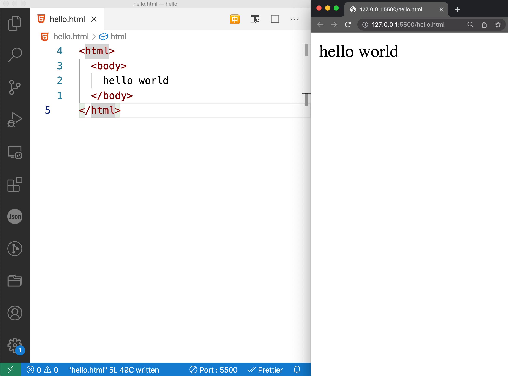

---
---

# 2. VSCode走起

工具善其事，必先利其器。网页师傅的器就是文本编辑器。用哪个都可以，新手的话就用VSCode吧。

下载好以后，打开。平常学习的流程是在显示器左边放VSCode，右边放浏览器。左边编辑文件，右边查看效果。如下图：

:::info VSCode小贴士
VSCode有n多插件(extensions)，这里推荐安装一个插件：Live Server。搜索安装即可。装好以后对于一个html文件，VSCode右下角点击`Go Live`即可在浏览器上打开这个网页。左边VSCode一保存，右边浏览器自动刷新看见最新效果。
:::