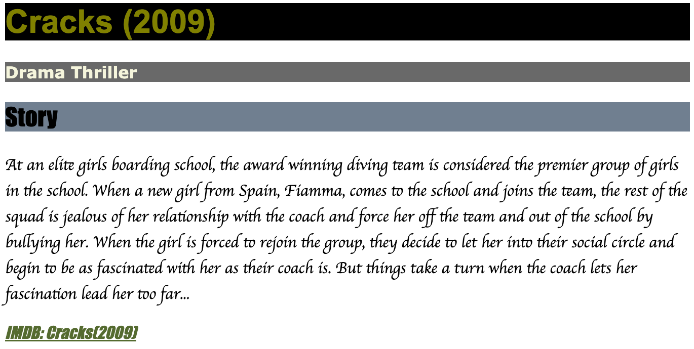

# 4. css - 网页的衣服

当网页的html写好之后，就有了骨和肉。但是只有html的网页是没法看的，就像人不穿衣服一样。。俗话说人靠衣装佛靠金装，同样网页也要靠好看的样式来提升颜值。这个网页的样式就是由css来控制的。

```html title="hello.html" line={4-6,11}
<html>
  <head>
    <style>
      .name {
        color: red;      <-- 这里是css的规则，这个规则为文字用红色显示
      }
    </style>
  </head>
  <body>
    <h1>hello</h1>
    <p class="name">jon snow</p>
  </body>
</html>
```

用法非常简单，在想加样式的标签加上一个`class="name"`，然后在`<style></style>`中间加上`.name {...}`即可。

:::note 注意
1. 在上面的例子中, `<p>`的class名字是`name`，上面css要用`.name`来引用哦；
2. `name`可以是任意的值，比如`abc`也可以，通常用一个比较有意义的名字。
:::

这里需要说一下，css本身内容很多，但是我们在初学的时候只需要会上面的写法就行了。想加什么样式，比如粗体字、加个边框什么的，可以查字典，就像学html一样。
### 作业

把上一课的作业加上一些css来提升一下网页的颜值。

import Tabs from '@theme/Tabs';
import TabItem from '@theme/TabItem';

<Tabs>
  <TabItem value="homework" label="作业" default>

```html title="movie.html"
<html>
  <head>
    <style>
      css写在这里
    </style>
  </head>
  <body>
    ...
  </body>
</html>
```

  </TabItem>
  <TabItem value="answer" label="参考答案">

```html title="movie.html"
<html>
  <head>
    <style>
      h1 {
        background-color: black;
        color: olive;
        font-family: Arial, Helvetica, sans-serif
      }

      h2 {
        background-color: slategray;
        font-family: Impact, Haettenschweiler, 'Arial Narrow Bold', sans-serif;
      }

      a {
        font-style: oblique;
        font-family: Impact, Haettenschweiler, 'Arial Narrow Bold', sans-serif;
        color: darkolivegreen   
      }

      .genres {
        background-color: dimgray;
        font-weight: 550;
        color: beige;
        font-family: Verdana, Geneva, Tahoma, sans-serif
      }
      
      .content {
        font-family: cursive;
      }
    </style>
  </head>
  <body>
    <h1>Cracks (2009)</h1>
    <p class="genres">Drama Thriller</p>
    <h2>Storyline</h2>
    <p class="content">At an elite girls boarding school, the award winning diving team is considered the premier group of girls in the school. When a new girl from Spain, Fiamma, comes to the school and joins the team, the rest of the squad is jealous of her relationship with the coach and force her off the team and out of the school by bullying her. When the girl is forced to rejoin the group, they decide to let her into their social circle and begin to be as fascinated with her as their coach is. But things take a turn when the coach lets her fascination lead her too far...</p>
    <a href="https://www.imdb.com/title/tt1183665">IMDB: Cracks(2009)</a>
  </body>
</html>
```

  

  </TabItem>
</Tabs>

### 参考资料
- [css tutorial](https://www.w3schools.com/css/default.asp)